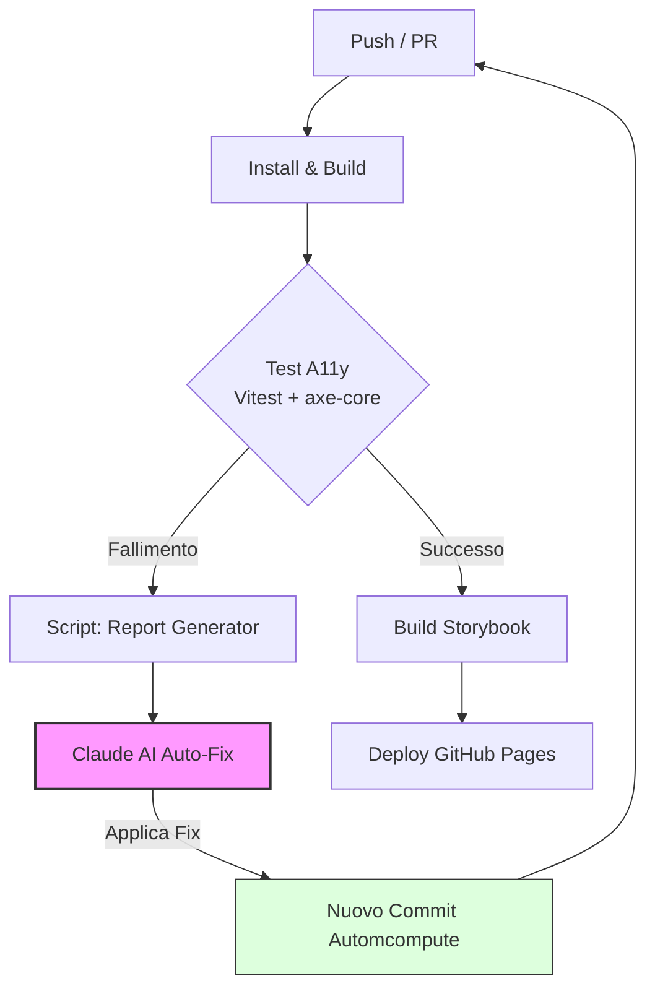
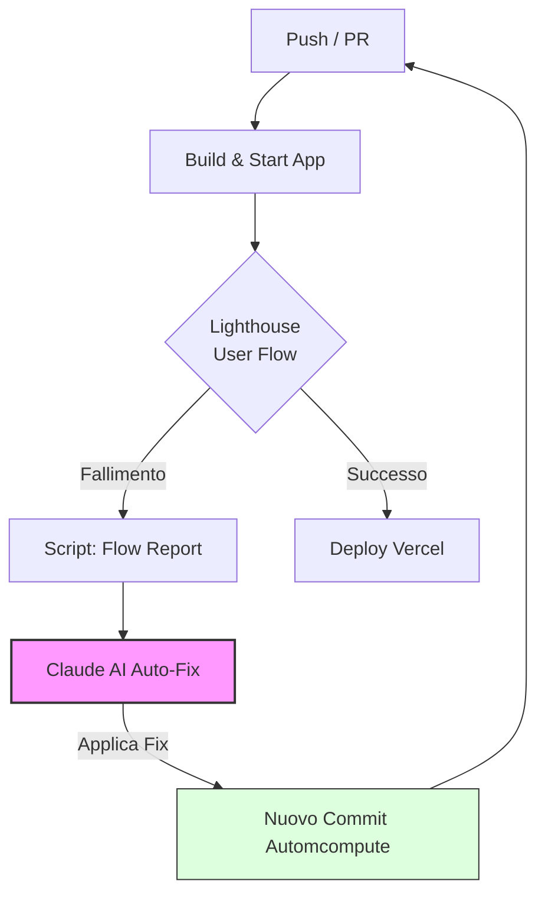

# Design System AI-Driven (Next.js + Figma MCP)

Questo repository è un ambiente pre-configurato per lo sviluppo di un Design System moderno, integrato con **Figma Dev Mode (via MCP)** e ottimizzato per workflow guidati dall'Intelligenza Artificiale (Claude Code).

## 🚀 Stack Tecnologico
- **Framework**: Next.js 16+ (App Router, React 19)
- **Styling**: Tailwind CSS v4
- **Linguaggio**: TypeScript
- **Documentazione & Testing**: Storybook 10 + Playwright + Vitest
- **Architettura**: Atomic Design (Atoms, Molecules, Organisms, Templates)

---

### 1. Architettura Atomic Design
Organizzata sotto `src/design-system/` con la seguente struttura:
- `atoms/`, `molecules/`, `organisms/`, `templates/`: Cartelle pronte ad ospitare i componenti.
- `tokens/`: Gestione centralizzata di colori, tipografia e spaziature (mapping Figma).
- **Barrel Strategy**: Ogni cartella contiene un `index.ts` per export puliti, facilitando l'auto-import da parte dell'AI.

### 2. Storybook & Quality Pipeline
- **Storybook 10**: Configurato per Next.js 16 e Tailwind v4. Supporta nativamente le `Play functions` per il testing delle interazioni.
- **Accessibility Testing**: `@storybook/addon-vitest` con axe-core per validazione WCAG 2.1 AA.
- **CI/CD Quality Gates**:
  - `yarn lint`: ESLint con regole Next.js e Storybook.
  - `yarn check`: Validazione tipi TypeScript.
  - `yarn test`: Test accessibilità Storybook con Vitest + axe-core.
  - `yarn format`: Prettier per la consistenza del codice.

### 3. Infrastruttura "AI Context" (VIVO)
È stato creato un sistema di file per istruire Claude Code e altri modelli AI su come operare:
- **`CLAUDE.md`**: Il cuore del contesto per Claude Code. Contiene le regole di sviluppo e il registro dinamico dei componenti.
- **`.agent/workflows/`**: Workflow operativi per Antigravity.
- **`.context/design-system.md`**: Mantiene il mapping tra gli ID di Figma e i file nel codice.
- **`.context/sdlc.md`**: Definisce le tappe del "Figma → Code → Docs" workflow.
- **`.context/skills/`**: Script e istruzioni specializzate (Figma integration, Design Rules).

### 4. Auto-Fix con Claude
Il sistema include un meccanismo di **auto-fix automatico** basato su Claude (Anthropic):
- **`anthropics/claude-code-action`**: GitHub Action ufficiale che analizza i report e applica fix automatiche.
- **Report Generator**: `scripts/vitest-report-generator.mjs` genera report strutturati dai test axe-core.
- **GitHub Actions Integration**: I workflow eseguono auto-fix su problemi di accessibilità (su PR) o creano Issue (su push).
- **Configurazione**: Richiede `ANTHROPIC_API_KEY` configurata come GitHub Secret.

---

## 🔄 Il Workflow "Figma → AI → Code"

Il progetto è progettato per questo flusso di lavoro:
1. **Figma Dev Mode**: Si seleziona un componente in Figma.
2. **Claude Code (MCP)**: L'AI legge via tool MCP le proprietà CSS e i token.
3. **Generazione**: L'AI genera il componente React (`.tsx`), i token Tailwind e la Story dedicata.
4. **Auto-Update**: L'AI aggiorna autonomamente `CLAUDE.md` e le documentazioni di contesto.

---

## 🔄 CI/CD Pipeline (AI-Powered)

Il sistema utilizza due pipeline automatizzate che integrano l'Intelligenza Artificiale per garantire la qualità del codice.

### 1. Design System Workflow (`storybook-tests.yml`)
Gestisce la documentazione e l'accessibilità dei componenti atomici.

**Step chiave:**
1. **Test accessibilità** — `@storybook/addon-vitest` + axe-core (WCAG 2.1 AA)
2. **Auto-Fix** — Claude analizza i fallimenti e propone fix automatiche
3. **Build Storybook** — genera la build statica (solo su main)
4. **Deploy** — pubblica su GitHub Pages (solo push su main, dopo che tutti i test passano)

### 2. Web App Workflow (`app-tests.yml`)
Gestisce la qualità dell'esperienza utente finale e il rilascio in produzione.

**Step chiave:**
1. **Lighthouse User Flow** — esegue script di navigazione utente per metriche performance/a11y (`yarn build` + `yarn start`)
2. **Auto-Fix** — Claude analizza i problemi rilevati da Lighthouse e corregge il codice
3. **Deploy Production** — pubblica su Vercel (solo push su main, dopo Lighthouse ok)

### Notifiche automatiche
Se Lighthouse CI rileva problemi, viene creato un **commento sul commit** GitHub con:
- Link ai report Lighthouse (consultabili per 7 giorni)
- Link diretto al workflow run

L'autore del commit riceve la notifica automaticamente.

### Soglie Lighthouse (`lighthouserc.js`)
| Metrica | Soglia | Effetto |
|---------|--------|---------|
| Performance | >= 0.9 | Warning (non blocca) |
| **Accessibility** | **>= 0.95** | **Error (blocca il deploy)** |
| Best Practices | >= 0.9 | Warning (non blocca) |

---

## 📦 Script Disponibili
- `yarn dev`: Avvia l'app Next.js.
- `yarn storybook`: Avvia l'ambiente di documentazione a http://localhost:6006.
- `yarn build-storybook`: Build statico di Storybook.
- `yarn test`: Esegue i test di accessibilità con Vitest + axe-core.
- `yarn test --watch`: Test in watch mode per lo sviluppo.
- `yarn lhci`: Esegue Lighthouse CI localmente.
- `yarn lint` / `yarn check`: Controlli di qualita.
